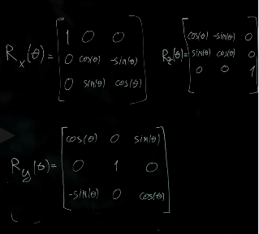
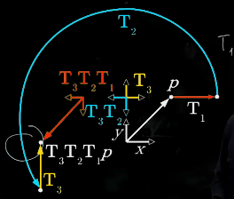

# Reasoning About Space and Transforms

2D Transforms, Homogenous Coordinates, 3D Transforms, Thinking about Transforms, Transform Inverse, Rotation Representations, Transforms in ROS, the TF Library, Project 2 released.  

## Transforms Introduction

${}^{A}T_{B} \cdot ^{B}p = ^{A}p$

where  
${}^{A}T_{B}$ is the transformation matrix from frame A to frame B.

${}^{A}T_{B} \cdot {}^{B}T_{C} \cdot ^{C}p = ^{A}p$

where  
${}^{A}T_{B}$ is the transformation matrix from frame A to frame B and  

${}^{B}T_{C}$ is the transformation matrix from frame B to frame C and.

## Rotations 2D

Transforming a point $p$ from the frame $B$ to the frame $A$.

${}^{A}p_{x} = {}^{B}p_{x} cos(\theta) - {}^{B}p_{y} sin(\theta)$  
${}^{A}p_{y} = {}^{B}p_{x} sin(\theta) + {}^{B}p_{y} cos(\theta)$

${}^{A}p = \begin{bmatrix}
           {}^{A}p_{x} \\
           {}^{A}p_{y} \\
         \end{bmatrix}
         = \begin{bmatrix}
           cos(\theta) - sin(\theta) \\
           sin(\theta) + cos(\theta)\\
         \end{bmatrix} 
         \begin{bmatrix}
           {}^{B}p_{x} \\
           {}^{B}p_{y} \\
         \end{bmatrix}$

${}^{A}p = {}^{A}R_{B} \cdot ^{B}p$

${}^{A}R_{B}$ is a rotational matrix.

### Properties of rotational matrices

1. Determinant is always $1$: $|R| = 1$
2. They are $orthonormal$: 
   1. the norm of every column and row is $1$
   2. the dot product of every 2 columns or 2 rows is $0$
3. Its inverse is equal to its transpose: ${}R^{-1} = {}R^{T}$.  
   1. ${}^{B}R_{A} = ({}^{A}R_{B})^{T}$
4. $R \cdot R^{T} = I$

## 2D Rotations Part II

From unit vector notations to rotation by using identity.

${}p = \begin{bmatrix}
           {}p_{x} \\
           {}p_{y} \\
         \end{bmatrix}
         = {}p_{x}\vec{x} + {}p_{y}\vec{y} =
         \begin{bmatrix}
           \vec{x} \ \vec{y}\\
         \end{bmatrix}
         \cdot
         \begin{bmatrix}
           {}p_{x} \\
           {}p_{y} \\
         \end{bmatrix} =
        \begin{bmatrix}
           1 \ 0 \\
           0 \ 1 \\
         \end{bmatrix}
         \cdot
         \begin{bmatrix}
           {}p_{x} \\
           {}p_{y} \\
         \end{bmatrix}$

where  
$\vec{x} = \begin{bmatrix}
           1 \\
           0 \\
         \end{bmatrix}$  
         $\vec{y} = \begin{bmatrix}
           0 \\
           1 \\
         \end{bmatrix}$

Change unit vector to:

where  
$\vec{x} = ^{B}\vec{x} = 
         \begin{bmatrix}
           cos(\theta) \\
           sin(\theta) \\
         \end{bmatrix}$  
         $\vec{y} = ^{B}\vec{y} = \begin{bmatrix}
           -sin(\theta) \\
           cos(\theta) \\
         \end{bmatrix}$

Column vectors show the orientation.

### Example  
Starting with a frame:  
  
and rotation  
  
results to  

## 2D Translations

${}^{A}p = {}^{B}p +
            \begin{bmatrix}
           t_{x} \\
           t_{y} \\
         \end{bmatrix}$  

## Homogenous Coordinates (Full Transformation)

${}^{A}p = {}^{A}R_{B}{}^{B}p +
            \begin{bmatrix}
           t_{x} \\
           t_{y} \\
         \end{bmatrix}$  

with

$^{A}T_{B} = \begin{bmatrix}
           ^{A}R_{B} \ \ \ ^{A}t_{B}\\
           0 \ \ \ \ \ \  1\\
         \end{bmatrix}$

$^{B}p = \begin{bmatrix}
           ^{A}p_{x} \\
           ^{A}p_{y} \\
           1 \\
         \end{bmatrix}
         =
         \begin{bmatrix}
           ^{A}R_{B} \ \ \ ^{A}t_{B}\\
           0 \ \ \ \ \ \  1\\
         \end{bmatrix}
         \cdot
         \begin{bmatrix}
           ^{B}p_{x} \\
           ^{B}p_{y} \\
           1 \\
         \end{bmatrix}$

Example:  

## 3D Transforms

Rotation is possible around any axis.

  

Examples of rotations around different axis:

## Transforms: Different Perspectives

There are 2 ways to "understand" the transformations:

1. Reference frame is changing with the transformation

   

   We start at frame $A$. We $move$ to coordinate frame $B$. And from there we abserve point $p$.

2. Reference frame stays the same but the position (of a point) is changing

    

    We observe point $p$ from frame $A$. And then it's actually point $p$ that moves and gets to a new location.

### Order of operations

Imagine there are 3 transformations:

To find a new position of $p$, we start from origin (identity $I$). Apply transformation $T3$:  

  

then $T2$  

and then $T1$:

So we are moving from left to right - starting with identity, than T3, T2 and T1:

It can be seen from different perspective - point $p$ is observed from origin and it is a point $p$ is moving:

Here we are moving another way around - from right to left.

## Transform Inverse

## Rotation Representations

### Axis angle

### Elementary rotation (euler angles)

### Unit quaternion

### Interchangability

### Pros and Cons

Any rotation in space can be specified with 3 numbers - 3DOF.
For any transform in space can be specified with 6 numbers - 6DOF.
