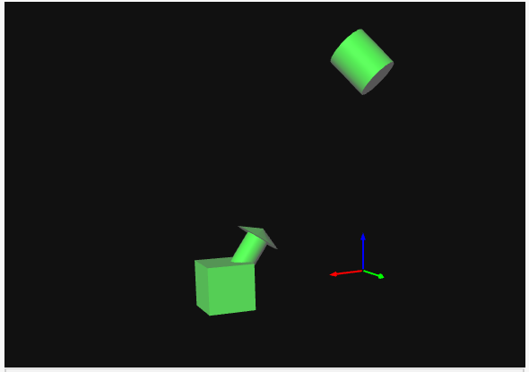

# CSMM.103x | Project 2

In this project we consider a ROS ecosystem, which consists of a robot with a camera mounted on it as well as an object. To describe the poses of all these items, we define the following coordinate frames:

- A base coordinate frame called '_base_'
- A robot coordinate frame  called '_robot_'
- A camera coordinate frame called '_camera_'
- An object coordinate frame '_object_'

The following relationships are true:

The transform from the '_base_' coordinate frame to the '_object_' coordinate frame consists of a rotation expressed as (roll, pitch, yaw) of (0.79, 0.0, 0.79) followed by a translation of 1.0 meter along the resulting y-axis and 1.0m along the resulting z-axis.

The transform from the '_base_' coordinate frame to the '_robot_' coordinate frame consists of a rotation around the z-axis by 1.5 radians followed by a translation along the resulting y-axis of -1.0m.

The transform from the '_robot_' coordinate frame to the '_camera_' coordinate frame must be defined as follows:
The translation component of this transform is (0.0, 0.1, 0.1)
The rotation component this transform must be set such that the camera is pointing directly at the object. In other words, the x-axis of the '_camera_' coordinate frame must be pointing directly at the origin of the '_object_' coordinate frame.

Write a ROS node that publishes the following transforms to TF:

- The transform from the '_base_' coordinate frame to the '_object_' coordinate frame
- The transform from the '_base_' coordinate frame to the '_robot_' coordinate frame
- The transform from the '_robot_' coordinate frame to the '_camera_' coordinate frame

## Additional Information

For a rotation expressed as roll-pitch-yaw, you can use the `quaternion_from_euler()` or `euler_matrix()` functions with the default axes convention - i.e. `quaternion_from_euler(roll_value, pitch_value, yaw_value)`.

**Be careful about the order of operations**. If a transform specifies that the rotation must happen first, followed by the translation (e.g. at points 1. and 2. above), make sure to follow that.

The transforms must be published in a continuous loop at a rate of 10Hz or more.

Once you run your code, these bodies will position themselves in space according to the transforms your code is publishing. The cylinder denotes the object, the cube and arrow the robot and camera respectively. If your code works correctly, you should see the arrow point out of the cube directly at the cylinder. Here is an example of the correct output (note that the colored axes show you the location of the base coordinate frame with the usual convention: x-red, y-green, z-blue):

## How do run this project in my own Ubuntu machine?
        
1. Launch Project 2, then in Vocareum click Actions>Download Starter code. This will download all the files you need to make the project run locally in your computer.
2. IGNORE all the files outside the catkin_ws folder. You do not need these in your local machine 
3. The downloaded files are structured as a catkin workspace. You can either use this structure directly (as downloaded) and build the workspace using the "catkin_make" command or use whatever catkin workspace you already had, and just copy the packages inside your own src folder. If you are having troubles with this, you should review the first ROS tutorial "Installing and configuring your ROS Environment".
4. Once you have a catkin workspace with the packages inside the src folder, you are ready to work on your project without having to make any changes in any of the files. 
5. NOTE: You can source both your ROS distribution and your catking workspace automatically everytime you open up a terminal automatically by editing the ~/.bashrc file in your home directory. For example if your ROS distribution is Indigo, and your catkin workspace is called "robotics_ws" (and is located in your home directory) then you can add the following at the end of your .bashrc file
source /opt/ros/indigo/setup.bash
echo "ROS Indigo was sourced"
source ~/robotics_ws/devel/setup.bash
echo "robotics_ws workspace was sourced
This way every time you open up a terminal, you will already have your workspace sourced, such that ROS will have knowledge of the packages there.
6. To run the project, open up a terminal and fire up a roscore (just type "roscore"). Before moving forward, if you haven't followed the instructions on step 5, you will need to source ROS and the catking workspace every time you open a new terminal. On another 2 separate terminals you need to run the scripts in each package: "rosrun marker_publisher marker_publisher" and "rosrun project2_solution solution.py". Now, to visualize the markers we need to launch rviz. In a new terminal type "rosrun rviz rviz". First thing you need to do is change the Fixed Frame option on the left of the UI. Select "base_frame", and notice that the Global Status now reads "Ok". Now we need to add the information we want to be displayed. Click Add and on the popup screen select the tab "By topic". Here you will see the topic /visualization_marker>Marker. Select it and then you should be able to see the block, cylinder and arrow. You can also add the item "TF" if you want to see a visual representation of the frames.

## How to aim the camera?

Hint: There is a simple geometrical argument that can help you rotate the x-axis of the arrow to point at the cylinder. Calculate the vector pointing from the camera to the object, use the dot and cross products to deduce the angle and axis to rotate around.