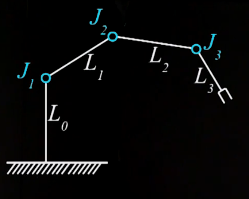
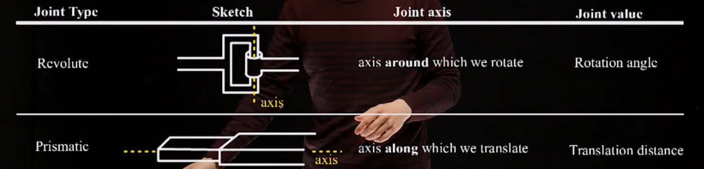
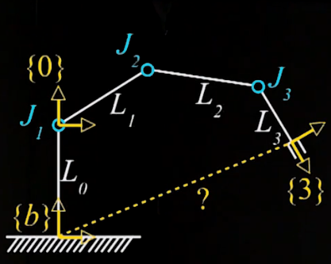
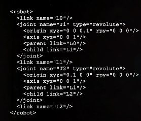
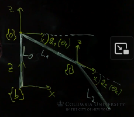
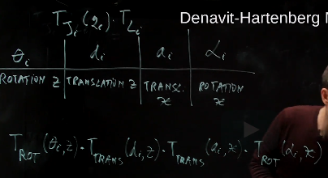

# Week 3: Robot Arms - Forward Kinematics

Robot Arms Introduction, Kinematic Chains, Forward Kinematics: URDF, Forward Kinematics: Analytical Methods, DH Parameters, Forward Kinematics:DH Examples, Project 3 released

## Kinematic Chains and Forward Kinematics

### Kinematic Chain

Kinematic chain is a sequence of joints and links. By modeling, a joint usually have a single degree of freedom.

There are revolute and prismatic joint:

### Forward Kinematics

Given the specific values for all the joints where is the end effector end up in space, considering where every link of the robot is (e.g. to avoid obstacles).

Attach a coordinate frame to each link, including base and end effector. What is the transform from base coordinate frame to the end effector coordinate frame.

Convention used in this course: joint Ji is followed by the link Li. At the end of the link Li is the coordinate frame i is attached. Ji is precceded by link Li-1.

 It gives following:

* n joints
* n + 1 links
* n + 1 coordinate frames
* Ji moves Li
* coordinate frame {i} is at the tip of the Li
* coordinate frame {n} is at end effector

There are different conventions. 

So what is the transform from the base to the end effector ${}^{b}T_{ee}$?

### Transform from the base to the end-effector

Chain every single transform fro the arm:

${}^{b}T_{ee} = 
T_{L_0} \cdot T_{J_1}(q_1) \cdot
T_{L_1} \cdot T_{J_2}(q_2) \cdot
T_{L_2} \cdot T_{J_3}(q_3) =
T_{L_0} \cdot 
\prod_{i=1}^{n} \cdot T_{J_i}(q_i) \cdot T_{L_i} 
$ 

where \
$T_{J_i}(q_i)$ - _variable_ transforms of the jount _i_ that depends on the joint angle $q_1$ \
$L_i$ - _fixed_ transforms of the links

The data is given by the robot manufacturer. The specification gives all the transforms $T_{L_i}$.

The robot is the system that continiously gives the values of the $q_i$.

## Forward Kinematics: URDF notation

URDF - Universal Robot Description Format.

URDF notation is not common in the industry, but commonly used in the research and in ROS.

The kinematic information is all comprised in the joint tag. There are much more tags, also for dynamic params, e.g. inetia or mass.

## Forward Kinematics: DH Examples

Industrial robots came decades ago, when the memory amount was very limited. So, more compacted way to describe kinemates was needed. Additionaly URDF doesn't lend itself to computing forward kinematics analytically, to comming up with just a nice formula. The Denavit-Hartenberg is one of the notations that is still in use nowadays. 
It is a convention:
- joint axis is local _z_. Axis for ${J_i}$ is ${Z_{i-1}}$. $Z$ axis of the coordinate frame $i-1$
- $L_i$ can be on of two: 
    - dtranslation around $x_i$
    - rotation around $x_i$ 

In DH-notation either $\theta$ or $d$ can be a joint "angle" and take a vvalue of $q_i$. First two components correspond to $T_{Ji}$. Second two components correspond to $T_{Li}$

## DH Notation Example: 2-link Planar Robot

## DH Notation Example: SCARA Robot

## DH Notation examples: 6DOF and 7DOF robots
