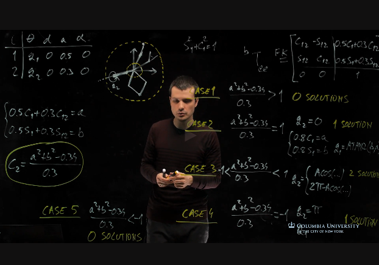
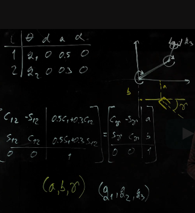
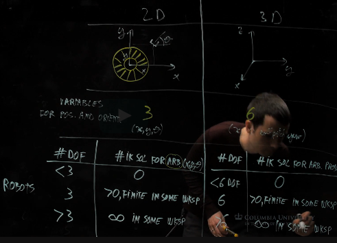

# Week 3: Robot Arms - Inverse Kinematics

Analytical IK, Robot Examples, Robot Workspaces and IK Solutions, Homework 1 released 

## Analytical IK, Planar Robot Example

There are also numerical ways to find IK solutions. Will be covered later.

### Problem definition

In real world we know where the target object is, and would like the end effector to be there.

So, we know the desired transform from the base to the end-effector. What we don't know is what are the joint values that the robot must have in order 
to get desired point/position in space.

IK problem:  we are given the desired transform from the base to the end-effector. We have to compute all the joint values that produce this transform.

### Planar Robot Example. Translation only.

Solve the forward kinematics. Set the desired coordinates (a,b) equal to the translation part. Solve the equation.

there are 5 cases:

- case 1: outside the workspace 0 solutions
- case 2: on the outer boundary 1 solution
- case 3: inside the workspace 2 solutions
- case 4: on the inner boundary 1 solution
- case 5: outside the inner boundary 0 solutions

### Planar Robot Example. Translation and orientation.

With only two joints (q1, q2) there is no way to solve the equation for three params (a,b, $\gamma$). Not enough degrees of freedom. Solution - add additional joint q3.

## Robot Workspaces and IK Solutions

### 2D and 3D space

- industrial robot arms are usually 6 degrees of freedom
- each new joint increase the complexity and cost
- 7 degrees of freedom can be found in research
- human arm can be approximated as 7 DOF arm -> to manage the complexity of the world?

## Analytical IK, Spherical Robot