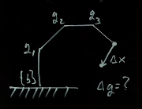
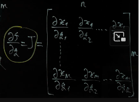
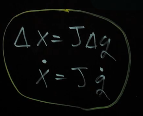

# Week 5: Differential Kinematics

Jacobian Definition and Analytical Computation, Singularities, Full Kinematics: Robot Examples, Homework 2 released

## 5.1 Differential Kinematics Introduction

Given desired motion/path in Cartesian space. How should the joint move in order for the robot to follow the path? Given $\delta{x}$ (vector of small changes in Cartisian space) what is $\delta{q}$ (vector of small changes of joints).

$ x + \delta{x} = f(q + \delta{q})$

linearize $f$ about $q$ and approximate:

$ x + \delta{x} = f(q) + \frac{\partial f}{\partial q} \delta{q}$

$ \delta{x} = \frac{\partial f}{\partial q} \delta{q}$

what is the vector $\frac{\partial f}{\partial q}$ and how to compute it?

## 5.2 Manipulator Jacobian

$\frac{\partial f}{\partial q}$ is a matrix of differentiations that is called a Jacobian of the function $f$.

$n$ columns - demmnsionality of the inputs of the function ($q$)
$m$ rows - demmnsionality of the outputs of the function ($x$)

Jacobian depends of the values of the $q$: $J(q)$. So it will be changed constantly with a moving robot, as $q$ values are changing. 

This relationship only holds for very small displacements (because of the liniearization).

## 5.3 Jacobian Example: Planar 2-link Robot

## 5.4 Singularities

## 5.5 Differential Kinematics Example- Spherical Robot

## 5.6 Joint Space vs. Cartesian Space

## 5.7 Differential Kinematics Example

## 5.8 Complete Kinematic Analysis Example
